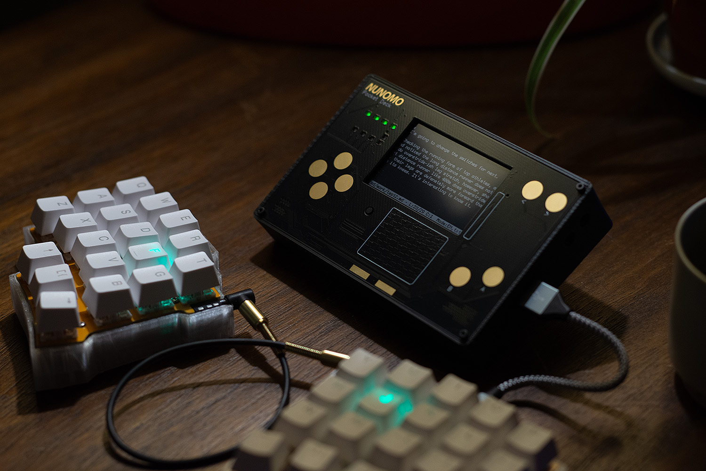

# Pocket Deck

Pocket deck is a tiny computer which can do small things, especially text writing, personal management, some audio processing and life improvement. It can be customized with MicroPython and powerful API, snappy graphics and quality audio.

# Purchase

https://shop.nunomo.net/products/pocket-deck-pre-order-status

# Features

## Hardware

- WiFi and Bluetooth for connectivity.
- Touch pad and touch buttons (AVR128 as a sub processor for touch inputs)
- Stereo Audio codec
- Stereo built-in speaker
- Stereo MEMS Microphone
- LEDs
- SD card slot
- Expansion port
- USB-A for USB keyboard, and USB-C for charging.
- RTC clock to keep date and time

## Accessaries

### USB keyboard & cable (Required)

You need USB keyboard and cable to operate the device.

### LiPo battery (Optional, recommended)

There is JST-PH connector on the main PCB. You can install LiPo battery. Around 3000mAh to 4000mAh is recommended. (Put some Amazon link here)
Battery operation is recommended.

### Magsafe stand (Optional, recommended)

Putting Magsafe sticker at back makes the device much more convenient. Put Magsafe sticker at the back. Position should be at top-center. There is a WiFi anntena at the botttom of the unit. Avoid to put the sticker at the bottom.

### Disassemble process

Following example is disassemble process to install LiPo battery.

1. Remove three screws on the top plate.

2. Remove front panel. Front panel and main panel are conntected by 0.1 inch pins. You can just pull the panel.

3. Remove main board. The board is just sitting on the case, no screws. Use SD slot or the other holes at the side of the case to get some leverage.

4. Install LiPo battery that you have. Preferrably use some double-sided tape to stick the battery.

5. Install the main board. There is a hole at the  right side for Lipo Battery cable.

6. Connect LiPo battery cable to the main panel. It's JST-PH connector. ** Check polarity of the battery before you connect it! There is no standard polarity in LiPo batteries, so it could be opposite. There are "+" and "-" marks on the PCB board. **

7. Install the front panel. Make sure to align pin headers.

8. Put on screws.

## Software overview

- A powerful text editor 100% written by MicroPython. See pem_readme.md for detail.
- Some utilities written by MicroPython, such as journal to chart, clock, calendar and kitchen timer.
- Up to 10 virtual screens. You can use them for multi-tasking, for example:
  - Screen 1: Micropython interactive shell(REPL)
  - Screen 2: Command line terminal
  - Screen 3: Text editor for jornaling or programming
  - Screen 4: Clock and calendar.
  - Screen 5: Game
  - Screen 6: Music player
  - Screen 7: SSH to your Linux computer
  - Screen 10: Home app

Screen 1,2 and 10 is permanently assigned for REPL, command line and Home app

## Touch buttons, power button and LEDs

Pocket deck has touch buttons on the front panel.

Button names | Description
-----|-----
Up, Down, Right and Left | It works as arrow keys. Arrow keys also can be used as like a dial by circling finger, if the application supports it. See get_tp_keys() for detail.
A | Enter
B | Backspace
Square shaped button (Left) | Home
Square shaped button (Right) | Help (F1 key), if application provides help.
touch pad | This can be used as a touch pad (mouse) if the application supports it.
`<` | Go to previous screen
`>` | Go to next screen
Slide bar at the right side | It scrolls the terminal screen to see previous messages. If the terminal sets as raw mode (esclib.raw_mode(True)), it works as Up/Down keys. 

Pocket deck has LEDs on the left side and it can be used for status indications.

- The 4 LEDs on the first row indicates battery status with LiPo battery connected.
- The red LED on the second row blinks when there is new output to Python REPL (screen 1).
- The leftmost LED on the third row indicates netowrk status. It will be on when it's connected.
- The rest 3 LEDs are for applications, can be controlled via Python.

There is a power button next to touchpad.

Press the button one time to power up the device with Lipo battery. It's always on when it's connected to power supply.

Press the button two times (like double click) to shutdown the device.

## System shortcuts

- C-[0-9] : (Control + 0-9) Switch screen
- C-Left or C-Right or left or right touch button on the device : Switch to next or previous screen
- C-Up or C-Down : Scroll on console
- S-C-r : (Shift + Control + R) Restart the device
- S-C-i : Invert color of the screen
- S-C-d : Detatch screen (Suspend application) for graphical application. It's useful when the application is out of control due to bug or any reasons.
- S-C-= : Increase font size. Unless the application has a logic to react the font size change, normally restarting application is necessary.
- S-C-- : Decrease font size.
- S-C-v : Paste data from system clipboard

## Basic file structure

/ : Root folder (Internal flash)
/config : Folder to store config information
/sd : SD card root
/sd/Documents : For user documents
/sd/lib : Built Python applications
/sd/lib/examples : Python application examples
/sd/py : Python application folder for user apps

## Getting started

See getting_started.md

## Micropython interactive console (REPL)

Micropython interactive console (REPL) is always available on screen 1. It' great for small tasks like calculator and debugging.
Program can keep running even when the screen is not selected.

## Command Shell

- Pocket deck has a simple command shell to execute built-in commands and Python scripts.

- Only a few commands are built-in, everything else are written by Python.

command | summary
--------|---------
cmd | launch a new command shell. Syntax is 'cmd [screen_number].
ssh | ssh command. Syntax is "ssh host username password".
scp | scp command. Syntax is "scp host username password copy_from copy_to". Remote path starts with ":". Example: scp 192.168.1.100 user password test.txt :/home/user/test.txt  . In command shell, internal flash is mounted to "/int". In Python, it is root("/").
Python module name or py module_name | Execute Python command. Syntax is "module_name [args] [args..]". Normally  module name is Python filename. Searching path is in sys.path list.

Here are some basic commands written by Python.

command | summary
--------|---------
ls [file] | List files. 
cp src dst | Copy file
mv src dst | Move file
mkdir dir_name | Create a directory
rmdir dir_name | Delete a directory
cat file | Print a file content
cd [dir] | Change working directory. Note this is global value, shared between shells.
pwd | Get current working directory
netserver | launch network server to serve services. Currently it's used for screencast.

## Basic applications

### Pem editor

Pem is emacs-inspired powerful editor written by Python. See pem_readme.md for detail. 

### Analog clock

Analog clock is useful application, it has analog clock, calendar and kicken timer. You can copy select date, it's useful for journaling.

### Journal

Journal analizes journal.md and visualizes to chart. Refer journal_readme.md for detail.

### Wavplay

Wavplay is audio player. Refer wavplay_readme.md for detail.

## Micropython Application development

You can make your own applications. Refer app_development.md for detail.

